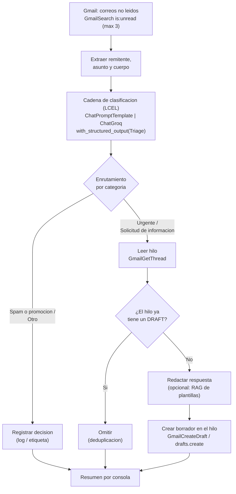

# Triage automatico de correo con LangChain — Nivel 2

Proyecto Integrador de **Sistemas Inteligentes 1** (Universidad de Caldas).
Reimplementacion en **LangChain (≥ 0.2)** del mismo caso de uso del **Nivel 1 (n8n)**:
un sistema que clasifica correos no leidos de Gmail y, segun la categoria, redacta un
borrador de respuesta (sin enviarlo) o solo registra la decision, evitando duplicar borradores.

---

## 1. Caso de uso

Para cada correo **no leido** de la bandeja:

1. **Clasifica** el correo en una de cuatro categorias:
   `Urgente`, `Solicitud de informacion`, `Spam o promocion`, `Otro`.
2. **Enruta y actua** segun la categoria:
   - `Urgente` / `Solicitud de informacion` → **redacta un borrador** de respuesta en espanol
     y lo crea **en el hilo del correo** (no lo envia, solo deja el borrador).
   - `Spam o promocion` / `Otro` → solo **registra/etiqueta** (no genera borrador).
3. **Deduplica**: antes de crear un borrador revisa el hilo; si ya existe un mensaje con la
   etiqueta `DRAFT`, **omite** la creacion para no duplicar borradores.

---

## 2. Arquitectura



**Flujo en una linea:** no leidos → clasificacion (Groq) → enrutamiento → deduplicacion → borrador / etiqueta.

### Cadena de pensamiento (CoT)
La salida estructurada incluye un campo `razonamiento` que obliga al modelo a explicar **paso a paso**
por que elige la categoria **antes** de decidirla (Zero-shot Chain-of-Thought). Esto mejora la
clasificacion y deja trazabilidad del por que de cada decision.

### RAG opcional (plantillas de respuesta)
El notebook incluye un modulo de **RAG** desactivable (`USE_RAG`, por defecto `False`): un vector store
local (Chroma) con plantillas de respuesta y embeddings gratuitos (HuggingFace / sentence-transformers).
Al redactar un borrador recupera la plantilla mas parecida para guiar el tono y la estructura. Si se deja
desactivado, el borrador se toma directamente del campo `borrador_respuesta` que ya produce el LLM.

---

## 3. Componentes LangChain (mapeo con la diapositiva 07)

| Componente | Implementacion en este proyecto |
|---|---|
| **LLM** | `ChatGroq(model="llama-3.3-70b-versatile", temperature=0.2)` |
| **ChatPromptTemplate** | system message con las reglas de triage + human template con el correo |
| **Tools** | `GmailToolkit`: `GmailSearch`, `GmailGetMessage`, `GmailGetThread`, `GmailCreateDraft` |
| **Chain / Agent** | cadena LCEL `prompt \| llm.with_structured_output(Triage)` + orquestacion en Python |
| **Salida estructurada** | `Pydantic` + `llm.with_structured_output(Triage)` |
| **Cadena de pensamiento (CoT)** | campo `razonamiento` en el esquema `Triage` (Zero-shot CoT) |
| **RAG (opcional)** | `Chroma` + `HuggingFaceEmbeddings` con plantillas de respuesta |

---

## 4. Comparativa n8n (Nivel 1) vs LangChain (Nivel 2)

| Aspecto | n8n (Nivel 1) | LangChain (Nivel 2) |
|---|---|---|
| Entrada | Gmail Trigger (polling de no leidos cada minuto, max 3) | `GmailSearch` con query `is:unread` (max 3) |
| LLM | nodo Groq (`llama-3.3-70b-versatile`, temp 0.2) | `ChatGroq` (mismo modelo y temperatura) |
| Prompt | prompt del AI Agent | `ChatPromptTemplate` (system + human) |
| Clasificacion | parser de salida estructurada | `Pydantic` + `with_structured_output` |
| Cadena de pensamiento | (implicita) | campo `razonamiento` explicito (CoT) |
| Enrutamiento | nodo Switch (4 ramas, fallback `Otro`) | `if/elif` en Python |
| Lectura de hilo | Gmail thread get | `GmailGetThread` / `api_resource` |
| Deduplicacion | Gmail thread get + IF (label `DRAFT`) | chequeo de label `DRAFT` en los mensajes del hilo |
| Borrador | nodo Gmail (draft create) en el hilo | `GmailCreateDraft` + `drafts().create()` con `threadId` |
| Etiquetado | nodo Gmail (add label) | log por consola (etiquetado via API es secundario) |
| Orquestacion | lienzo visual de nodos | script Python determinista (notebook) |

> **Por que cadena + orquestacion en Python y no un agente ReAct:** el enfoque LCEL + logica en Python
> es mas **determinista** y mas facil de explicar linea por linea en la sustentacion oral, manteniendo
> la equivalencia funcional con el Switch de n8n.

---

## 5. Instalacion

Requisitos: **Python 3.11+**.

```bash
# 1. Crear y activar el entorno virtual
python -m venv .venv
# Windows (PowerShell):
.venv\Scripts\Activate.ps1
# Linux / macOS:
# source .venv/bin/activate

# 2. Instalar dependencias
pip install -r requirements.txt

# 3. (Opcional) Activar el RAG de plantillas:
#    descomenta las 3 lineas del bloque RAG en requirements.txt, reinstala,
#    y pon USE_RAG = True en el notebook.
```

---

## 6. Credenciales

### 6.1 Groq (LLM)
1. Crea una API key gratis en [console.groq.com](https://console.groq.com) → **API Keys**.
2. Copia `.env.example` a `.env` y pega tu clave:
   ```
   GROQ_API_KEY=gsk_...
   ```

### 6.2 Gmail (tools) — Google Cloud Console
1. Crea un proyecto en [console.cloud.google.com](https://console.cloud.google.com).
2. **Habilita la Gmail API** (APIs y servicios → Biblioteca → Gmail API → Habilitar).
3. **Pantalla de consentimiento OAuth**: tipo *Externo*; agrega tu propio correo como **usuario de prueba**.
4. **Credenciales** → *Crear credenciales* → *ID de cliente de OAuth* → tipo **Aplicacion de escritorio**.
5. **Descarga** el JSON y guardalo en la raiz del proyecto como **`credentials.json`**.
6. El **primer** run abre el navegador para autorizar y genera **`token.json`** automaticamente.

> Usa la **misma cuenta de Gmail** del Nivel 1.
> `credentials.json` y `token.json` estan en `.gitignore`: **no se versionan**.

---

## 7. Uso

1. Activa el venv y asegurate de tener `.env` y `credentials.json` en su sitio.
2. Abre el notebook:
   ```bash
   jupyter notebook triage_langchain.ipynb
   ```
3. Ejecuta las celdas de arriba a abajo. La celda de **prueba offline** clasifica 4 correos de ejemplo
   (uno por categoria) sin tocar Gmail; la celda de **ejecucion** procesa la bandeja real.

> Sugerencia para el video: para una demo controlada, enviate a ti mismo correos de prueba que
> encajen en cada categoria y dejalos **sin leer** antes de ejecutar la orquestacion.

---

## 8. Estructura del repositorio

```
triage-langchain/
├── triage_langchain.ipynb      # notebook principal, celdas comentadas por componente
├── requirements.txt
├── README.md                   # este archivo
├── .env.example                # plantilla SIN la key real
├── .gitignore                  # excluye .env, credentials.json, token.json, .venv/
└── workflow/
    └── flujo_principal.json    # export del workflow n8n del Nivel 1 (lo agregas tu)
```

---

## 9. Criterios de aceptacion (rubrica)

- [x] Cada componente (LLM, prompt, tools, chain, CoT) identificado y comentado en el notebook.
- [x] Clasificacion en las 4 categorias (con prueba offline reproducible).
- [x] Creacion de borrador real en el hilo para `Urgente` / `Solicitud de informacion`.
- [x] Deduplicacion: no crea borrador si el hilo ya tiene uno (label `DRAFT`).
- [x] README con diagrama de arquitectura y comparativa n8n vs LangChain.
- [x] Secretos NO versionados (`.gitignore` correcto, `.env.example` sin clave real).

---

## 10. Declaracion de uso de IA

En cumplimiento de la integridad academica del proyecto, se declara el uso de IA generativa
(asistente de codigo) en la elaboracion de este Nivel 2:

- **Asistido por IA:** estructura del notebook y comentarios por componente, redaccion de este README
  (diagrama Mermaid y tabla comparativa), borrador del system prompt de clasificacion y del esquema
  Pydantic, y el andamiaje del modulo RAG opcional.
- **Trabajo propio del estudiante:** definicion del caso de uso y su equivalencia con el Nivel 1,
  configuracion de credenciales (Groq y Google Cloud), ejecucion y pruebas reales contra la cuenta de
  Gmail, ajustes finales del prompt y validacion de resultados, y la sustentacion oral de cada fragmento
  de codigo.